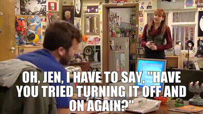

*  this unordered seed list will be replaced by the toc
{:toc}

## 그래가지고

우선, 블로그 만들고 공부하느라 어지러웠던 심신을 달래주었던 음악을 공유한다.

    <iframe width="514" height="285" src="https://www.youtube.com/embed/AawLM81gIHo" title="YouTube video player" frameborder="0" allow="accelerometer; autoplay; clipboard-write; encrypted-media; gyroscope; picture-in-picture" allowfullscreen></iframe>

{:.centered}

 

>이 블로그를 만들기 위해 대략 1주일동안 12개 정도의 블로그가 생성되었다가 사라졌다.   
>그 말인 즉슨 내 잔디들도 몽땅 뽑혔다가 다시 자랐다가를 반복했다는 뜻이다.   
>그 말인 즉슨 *2 기록되지 못하고 뽑힌 잔디들을 기억하고자 하는 것이 이 포스팅의 목적이란 것.

 

{:.centered}
위 아이콘은 이 블로그의 파비콘이 되려던 아이였으나 어떻게 하는지 몰라 그대로 폴더 숲에 버려졌다.
{:.figcaption} 

 

{:.text-align-center}
{:width="40%"}
{:width="40%"}{:.centered} 

 

위 사진은 마크다운 사용법에 익숙해지고자 그냥 넣어본 사진.   
과연 이 사진은 가운데 정렬이 될 것인가 (css와의 합작이다)  

 

많은 후기들이 올라와 있는 초 인기 테마를 선택했다면 블로그를 만드는 길이 조금은 쉬웠을까..   
하지만 [hydejack](https://hydejack.com)테마가 내 맘에 쏙 들었기 때문에 선택은 하나 뿐이었다.   

 

## 아무튼 블로그를 만들고 드는 생각을 몇 가지 쓰자면

1. 나도 **트친**이 있었으면 좋겠다. **트위터 계정**을 올려뒀으니 많관부.
2. 공부한 내용을 올리게 될텐데 부디 **깃헙 블로그 용량제한**에 걸리길..
3. 하나마나한 말 하지 않기를...

 

처음엔 깃허브블로그가 귀찮은 일이라고 생각했는데 7일 가까이 수 없이 실패해도 결국 여기까지 온 걸 보니 꽤나 재미있었나보다.  
게다가 [블로그 글 작성법](https://lynmp.com/en/article/title/how-to-use-markdown-oz811c9dc5pz)도 호락호락한 편은 아니지만 그래도 이렇게 글 하나 작성해서 업로드한 걸 보면 그렇게 뿌듯할 수가 없다.   

 
 

자 이만 줄이고 공부하러 뽈뽈.

---

### Original_Source
[마크다운 글 작성법](https://lynmp.com/en/article/title/how-to-use-markdown-oz811c9dc5pz)