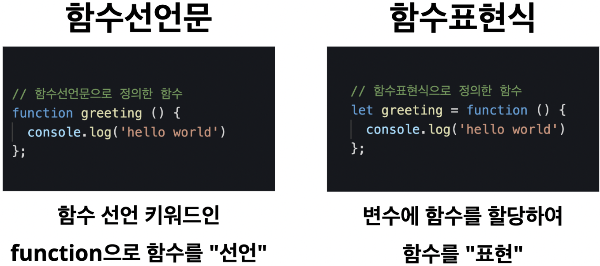

* this unordered seed list will be replaced by the toc
{:toc}

<!--more-->

# 함수?
1. 논리적인 일련의 작업을 하는 하나의 단위  
2. 입력을 받아서 코드블록 내부의 코드를 실행한 후 함수의 실행결과를 반환하는 일련의 과정의 묶음
3. 특정한 코드실행 과정을 묶어서 함수를 생성하는 것을 **<span style="color: tomato">'함수를 정의한다'</span>**고 한다.


### 함수가 실행되는 루트

1. 함수 외부에서 특정한 입력값을 전달하여 호출하면
2. 함수의 내부의 코드가 실행된다.
3. 함수의 실행결과는 함수 외부의 호출된 곳으로 반환한다 => return

>함수를 사용한다는 것은 특정한 코드실행 과정을 하나의 묶음으로 묶어서 필요할 때마다 호출하여 실행한다는 것

## 함수선언문, 함수표현식
### 함수선언문으로 함수를 정의하면?
```JavaScript
function hello(){
  console.log('hello')
};
```
1. 변수를 선언할 때 `let`을 사용하듯 함수를 선언할 때는 `function`을 사용한다.
2. `function`키워드 뒤에는 **함수명**을 지정한다.
3. 함수명 뒤에 소괄호 `()`를 입력한다. (소괄호 안에는 함수 내부에서 사용할 매개변수를 사용할 수 있다.)
4. 소괄호 뒤에 **실행할 코드를** 코드블록 `{}`내부에 입력한다.

### 함수표현식으로 함수를 정의하면?
```JavaScript
let hello = function(){
  console.log('hello')
}
```
1. `let`키워드를 사용해 변수를 선언하고 함수를 할당하는 형태로 코드를 작성한다.  
위와 같이 함수를 변수에 할당하는 것이 가능하다. 이를 **함수 표현식**이라 한다.




## 함수 호출
>함수 내부에 있는 코드는 함수를 호출 했을 때만 실행된다. 

### 함수를 실행하는법 (함수호출과정)
```JavaScript
function hello(){
  console.log('hello')
}

hello() // hello
```

위처럼 함수를 정의할 때 지정한 **함수명 뒤에 소괄호 `()`**를 붙이면 함수를 호출할 수 있다.  


## 매개변수와 전달인자

**<span style="color: tomato; font-size: 1.2rem">매개변수는 함수를 정의할 때 선언하고, 함수 코드 블록안에서 변수처럼 취급된다.</span>**

```JavaScript
function hello(hi){
  console.log('hello' + hi)
}

hello('bye') //hellobye
```
위 함수를 보면 `hi`라는 매개변수에 `'bye'`라는 문자열이 전달된 것을 확인할 수 있다.  


`hello`라는 이름의 함수가 `hi`라는 매개변수를 가지고 있다.  
매개변수는 선언되었을 뿐 값이 할당되지 않아 `undefined`로 초기화되어 있다.  
-> `hi`라는 매개변수에 값을 할당해야한다.  
--> **<span style="color: tomato; font-size: 1.2rem">전달인자</span>**를 사용하자  


>함수를 호출할 때 소괄호 안에 값을 넣음으로써 매개변수에 값을 할당할 수 있다. => 전달인자


### 매개변수를 여러 개 사용하는 것도 가능할까?
**<span style="color: tomato; font-size: 1.2rem">가능합니다</span>**  
매개변수의 개수에 맞게 전달인자를 전달하면 매개변수에 차례대로 전달된다.  
```JavaScript
function students(s1, s2){
  console.log("hi, " + s1 + ' ' +s2)
}

students('tom', 'john') //hi, tom john
```

#### 매개변수의 수보다 적은 전달인자가 전닫된다면? || 매개변수의 수보다 많은 전달인자가 전달된다면?
아무것도 전달되지 않은 매개변수는 `undefinded`로 초기화 되어 있다.  
아무것도 할당하지 않은 변수가 초기화되어 있는 것과 같다.  

```JavaScript
function students(s1, s2){
  console.log("hi, " + s1 + ' ' +s2)
}

students('tom') //hi, tom  undefined
```

<details>
<summary style="color: tomato; font-size: 1.2rem">Scope?</summary>
<div markdown="1">

>변수가 유효한 범위를 스코프(SCOPE)라 한다.

**매개변수는 함수 내부에서만 사용이 가능하다.  
함수 내부에서 선언한 변수도 함수 내부에서만 사용이 가능하다.**  

<span style="color: tomato; font-size: 1.2rem">매개변수와 함수 내부에서 선언한 변수는 자신이 선언된 위치에 따라 유효범위가 결정된다.</span>  


```JavaScript
function hello(fine){
  let good = 'morning';
}

console.log(fine) 
//Uncaught ReferenceError: fine is not defined
console.log(good)
//Uncaught ReferenceError: good is not defined
```

</div>
</details>


## 리턴문 (return)
콘솔창에 출력하는 것 말고 실제 함수 실행결과를 외부로 반환하는 리턴문.  
반환하다 = 함수 외부에서 함수의 결과값을 사용할 수 있다

```JavaScript
function hello(a, b){
  return a + b; 
}
```

### return이 중요한 이유?
1. 함수 내부의 코드가 차례대로 실행되다가 return문을 만나면 값을 반환한 후 함수는 종료된다. (return문 뒤의 코드는 실행되지 않는다.)
```JavaScript
function add(x,y){
  return x + y
  console.log('실행되지 않는다')
}

add(1, 2) //3
```

2. return문에 작성된 코드를 실행하고 결과를 함수 외부로 리턴한다. (함수 외부에서 함수를 호출하면 함수의 실행결과를 확인할 수 있다.)
```JavaScript
function add(x, y){
  return x + y;
}

console.log(add(2,3)) // 5
```

3. 함수 호출의 결과를 변수에 할당하는 것도 가능하다.
```JavaScript
function add(x, y){
  return x + y
}

let result = add(3, 4);
console.log(result) // 7
```

4. 함수의 호출 결과끼리의 연산도 가능하다.
```JavaScript
function add (x, y){
  return x + y;
}

let result = add(4, 5) + add(5, 6);
console.log(result) //20
```