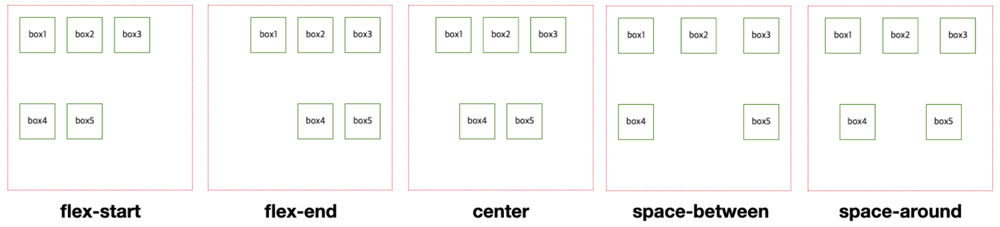
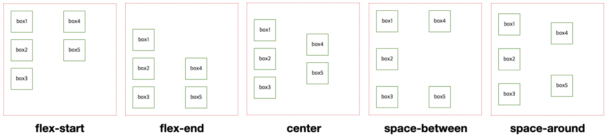
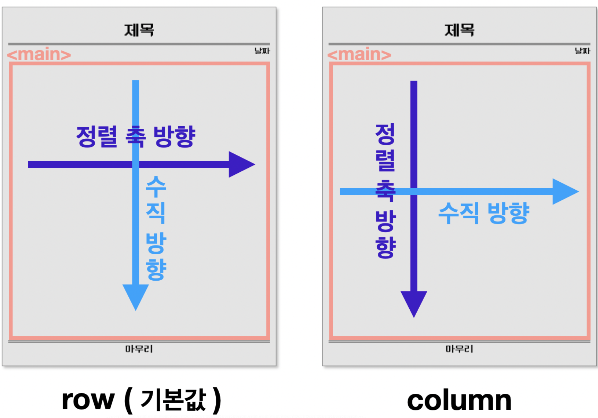
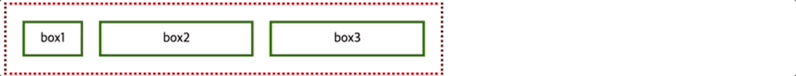

* this unordered seed list will be replaced by the toc
{:toc}

<!--more-->

>Flex(Flexible)는 "잘 구부러지는, 유연한"이라는 뜻이다.
>Flexbox는 박스를 유연하게 늘리거나 줄여 레이아웃을 잡는방법.

## Flexbox?
`display: flex`는 부모 박스 요소에 적용해, 자식 박스의 방향과 크기를 결정하는 레이아웃 구성 방법.  
flexbox의 속성들을 활용해 **요소의 정렬**, **요소가 차지하는 공간**을 설정해줄 수 있다.  

### 부모요소에 적용하는 Flexbox 속성?
Flexbox의 부모요소에 적용해야하는 속성은 자식 요소들의 **'정렬'**과 관련이 있다.

#### 1. flexbox-direction : 정렬 축 정하기
`flex-direction`속성은 자식 요소들을 정렬할 정렬 축을 정한다.  
아무 설정 없을 시, 기본값은 가로정렬이다. (row)  

```CSS
main{
  display: flex;
  flex-direction: row;
}
```


#### 2. flex-wrap : 줄 바꿈 설정하기
`flex-wrap`속성은 하위 요소들의 크기가 상위 요소의 크기를 넘으면 자동 줄 바꿈을 할 것인지 정한다. 기본값은 **줄 바꿈을 하지 않는다.**  

```CSS
main{
  display: flex;
  flex-wrap: nowrap;
}
```


#### 3. justify-content: 축 수평 방향 정렬
`justify-content`속성은 자식 요소들의 수평 방향으로 어떻게 정렬할 것인지 정한다.  
요소들이 가로로 정렬되어 있다면 가로로 어떻게 정렬할 것인지,  
요소들이 세로로 정렬되어 있다면 세로로 어떻게 정렬할 것인지 정하는 속성이다.  

  

주요 속성값으로는 `flex-start`, `flex-end`, `center`, `space-betwee`, `space-around`가 있다.  

- `flex-direction: row`인 경우


- `flex-direction: column`인 경우



#### 4. align-items: 축 수직 방향 정렬
`align-items`속성은 자식 요소들을 축의 수직 방향으로 어떻게 정렬할 것인지 정한다.  
요소들이 **가로** 정렬되어 있다면 **세로** 방향으로 어떻게 정렬할 것인지  
요소들이 **세로** 정렬되어 있다면 **가로** 방향으로 어떻게 정렬할 것인지 정하는 속성이다.



주요 속성값으로는 `stretch`, `flex-start`, `flex-end`, `center`, `baseline`이 있다.

- `flex-direction: row`인 경우


- `flex-direction: column`인 경우


### 자식요소에 적용하는 Flexbox 속성?
Flexbox의 자식요소에 적용해야하는 속성은 요소가 차지하는 **'공간'**과 관련이 있다.

#### 1. flex 속성의 값
flex속성에는 세 가지 값을 지정해줄 수 있다.  

1. grow (팽창 지수) : 요소의 크기가 늘어나야 할 때, 얼마나 늘어날 것인가
2. shrink (수축 지수) : 요소의 크기가 줄어들어야 할 때, 얼마나 줄어들 것인가
3. basis (기본 크기) : 늘어나고 줄어드는 것과 상관없이 요소의 기본 크기는 얼마인가


자식 요소에 flex 속성을 따로 설정하지 않았을 때의 기본값은 다음과 같으며 왼쪽에서 오른쪽으로 콘텐츠의 크기만큼 배치된다.

```CSS
flex: 0 1 auto;

/* 
flex: grow shrink basis;
*/

flex-grow: 0;
flex-shrink: 1;
flex-basis: auto;
```

#### 2. grow: 얼마나 늘어날까?
**<span style="font-size: 1.2rem; color: tomato">팽창지수는 공간 총합에서의 비율로 빈 공간을 자치하게 된다.</span>**  


#### 3. shrink: 얼마나 줄어들까?
**<span style="font-size: 1.2rem; color: tomato">수축지수는 grow와 반대로 설정한 비율만큼 박스크기가 작아진다.</span>**  
grow 속성과 함께 사용하는건 지양해야한다. 기본값은 1이다.  


#### 4. basis: 기본 크기는 얼마일까?
**<span style="font-size: 1.2rem; color: tomato">기본크기는 자식박스가 grow, shrink에 의해 변하기 전까지는 기본크기다.</span>**  
flex-grow가 0일 때만, basis 크기를 지정하면 그 크기는 유지된다.




<details>
<summary style="color: tomato; font-size: 1.2rem">Tip</summary>
<div markdown="1">

- width와 flex-basis를 동시에 적용하는 경우, flex-basis가 우선됨.
- 콘텐츠가 많아 자식 박스가 넘치는 경우, width가 정확한 크기를 보장하지 않음.
- (flex-basis를 사용하지 않는다면) 콘텐츠가 많아 자식 박스가 넘치는 경우를 대비해, width 대신 max-width를 쓸 수 있다.

</div>
</details>