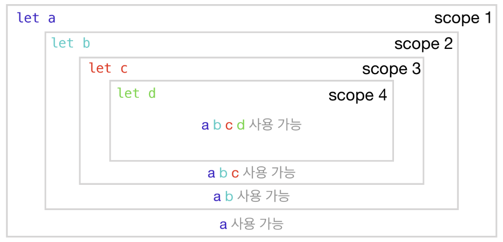

* this unordered seed list will be replaced by the toc
{:toc}

<!--more-->

## 원시 자료형 & 참조 자료형

### 원시자료형
>JavaScript에서 원자시료형은 객체가 아니면서 method를 갖지 않는 6개의 타입
>string, number, ~~bigint~~, boolean, undefined, ~~symbol~~, (null) (취소선은 자주 쓰지 않는 타입)

원시자료형은 모두 "하나"의 정보, 즉 데이터를 담고 있다.  
==데이터 보관함 한 칸에 하나의 데이터만== 넣을 수 있는 "원시적인"방식.  
그래서 원시자료형이 담기는 보관함의 크기는 고정하는 것이 합당하다. (데이터 크기를 예측 가능하기 때문)  
**<span style= "color: tomato; font-type: 1.3rem">=> 변수에는 하나의 데이터만 담는다</span>**  

원시 자료형은 값 자체에 대한 변경이 불가능하지만 변수에 다른 데이터를 할당할 수는 있다.  


### 참조자료형
>원시 자료형이 아닌 것은 모두 참조 자료형이다. (배열, 객체 함수가 대표적이다.)
>참조 자료형에는 하나가 아닌 여러 개의 데이터가 담긴다.

변수에는 참조 자료형이 저장되는 데이터 보관함을 찾아갈 수 있는 ==주소==가 담겨있고 주소가 가리키는 곳에 위치한 데이터 보관함의 사이즈는 동적으로 변한다.  


<span style="font-size: 1.2rem">:smirk: 정리하면</span>
원시 자료형이 할당될 땐 변수에 값 자체가 담기고,  
참조 자료형이 할당될 땐 보관함으 주소가 담긴다.  

참조자료형은 기존에 고정된 크기의 보관함이 아니라, 동적으로 크기가 변화는 특별한 보관함을 사용할 수 있다.  

## 스코프
스코프는 '변수 접근 규칙에 따른 유효 범위'이다.  

### 스코프의 주요 규칙
1. 안쪽 스코프에서 바깥쪽 스코프로는 접근할 수 있으나 반대는 불가능
2. 스코프는 중첩이 가능하다.
   1. 가장 바깥쪽 스코프는 **전역 스코프**라고 부른다.
   2. 전역이 아닌 다른 스코프는 전부 **지역 스코프**라고 부른다.
      1. 지역 스코프에 선언한 변수는 **지역 변수**, 전역 스코프에서 선언한 변수는 **전역변수**라고 부른다.

3. 지역 변수는 전역변수보다 우선순위가 높다.

### 스코프와 변수 선언
스코프는 두 가지 종류가 있다.  
블록스코프 : 중괄호를 기준으로 번위가 구분된다. (단, 화살표함수는 블록스코프다.)  
함수스코프 : function keyword가 등장하는 함수 선언식 및 함수 표현식  

#### var로 변수를 선언하면?
```javascript
for(var i = 0; i < 5; i++>{
  console.log(i);
})
console.log('iis i:', i);
```
= 블록범위를 벗어나도 변수 i 에 접근이 가능하다.  
**<span style="color: tomato; font-size: 1.2rem">var키워드는 블록 스코프를 무시하고 함수 스코프만 따른다.</span>** (단, 화살표함수의 블록스코프는 제외)  

그러나 위처럼 예외의 예외가 있는 등 사용시 고려해야할 점이 많으므로,  
블록 단위로 스코프를 구분했을 때 훨씬 더 예측 가능한 코드를 작성할 수 있는 'let'키워드의 사용을 권장한다.

* var보다 let을 더 권장하는 또 다른 이유
  * var키워드는 재선언을 해도 에러가 나지 않지만 let 키워드는 에러가 나 재선언을 방지한다. (재선언 남발하면 뭐가 뭔지 알 수 없어 코드작성에 혼란을 가져다 줄 수 있다.)
* 또 다른 변수 선언 키워드 const
  * 변하지 않는 값. 상수를 정의할 때 사용.
  * 값의 재할당이 불가하여 의도치 않은 값의 변경을 막을 수 있다.


### 변수 선언에서 주의할 점.
1. var로 선언된 전역 변수 및 전역 함수는 window 객체에 속하게 된다.
```javascript
var myName = 'jscho';
console.log(window.myName); // jscho

function func(){
  console.log('bar');
}

console.log(foo === window.foo); //true
```


2. 전역 변수에 너무 많은 변수를 선언하지 말 것.
   1. 편리하지만 다른 함수 혹은 로직에 의해 의도치 않은 변경 발생할 수 있다. (side effect)

3. let, const를 주로 사용하라
   1. var는 블록 스코플르 무시하며 재선언을 해도 에러를 내지 않아 버그를 유발한다.
   2. 전역 변수를 var로 선언하면 window 기즌을 덮어씌워 내장 기능을 사용할 수 없게 만들 수 있다.

4. 선언 없는 변수 할당 금지
   1. 선언 키워드( var, let const)없이 변수를 할당하면 해당 변수는 var로 선언한 전역변수처럼 취급된다.
      1. 'use strict' (엄격모드)를 사용해 보다 엄격하게 에러를 판단할 수 있다. (파일 상단에 입력)

## 클로저
### 클로저의 특징
1. 함수를 리턴한다.
2. 내부 함수는 외부 함수에 선언된 변수에 접근 가능.
>함수를 리턴하는 함수


```javascript
const adder = x => y => x + y;

const adder = function (x) {
  return function (y) {
    return x + y;
  }
}

// 위, 아래의 adder 함수는 동일하게 작동한다.
```

클로저는 리턴하는 함수에 의해 스코프가 구분된다.  
클로저의 핵심은 스코프를 이용해 변수의 접근 범위를 닫는 데에 있다. (closure)  
중요한 건, 변수가 선언된 곳.

### 클로저의 활용
1. 
일반적인 함수는, 함수 실행이 끝나고 나면 함수 내부의 변수를 사용할 수 없다.  
그러나 클로저는 외부 함수의 실행이 끝나도, 오부 함수 내 변수가 메모리 상에 저장된다.  

예시를 보자  
#### 1. 데이터를 보존하는 클로저 함수
```javascript
const tagMaker = tag => content => `<${tag}>${content}</${tag}>`

const divMaker = tagMaker('div');
//`<div>${content}</div>`

divMaker('hello') //`<div>hello</div>`
divMaker('codestates') // `<div>codestates</div>`

const anchorMaker = tagMaker('a');
//`<a>${content}</a>`

anchorMaker('go') // `<a>go</a>`
anchorMaker('urclass') // `<a>urclass</a>`
```

#### 2. 클로저 모듈 패턴
  클로저를 이용해 내부 함수를 하나만 리턴하지 않고 객체에 담아 여러 개 리턴하게 만든다.

```javascript
const makeCounter = () => {
  let value = 0;

  return {
    increase: () => {
      value = value + 1
    },
    decrease: () => {
      value = value - 1
    },
    getValue: () => value
  }
}

const counter1 = makeCounter();
//counter1은 객체이다.
```
Q. makeCounter함수를 바꾸지 않고 value란 변수에 값을 새로 할당할 방법이 있을까?  
A. NO. 직접 수정은 불가능하다. (->  캡슐화라고 한다.)리턴하는 객체가 제공하는 메서드를 통해 간접 조작은 가능.  

```javascript
const counter1 = makeCounter();
counter1. increase();
counter1. getValue(); //1

const counter2 = makeCounter();
counter2.decrease();
counter2.getValue(); //-1
```
counter1과 counter2는 각각의 값을 가지고 있다.  
함수 사용성을 극대화하여 서로에게 영향을 끼치지 않고 각각의 값을 독립적으로 가질 수 있다.  


이와 같이 함수 하나를 완전히 독립적인 부품 형태로 분리하는 것

**<span style="color: tomato; font-size: 1.2rem">=> 모듈화</span>**

클로저는 모듈화에 유리하다.  


## ES6 주요문법

### spread / rest
1. spread문법
배열을 풀어서 인자로 전달하거나 배열을 풀어 각각의 요소로 넣을 때 사용한다.  
spread문법은 배열에서 잘 쓰인다.  
spread문법은 immutable(변경하지 않는다)하다. (필요하면 값 재할당을 해야함)

```javascript
function sum(x, y, z){
  return x + y + z;
}

const numbers = [1, 2, 3];

sum(...numbers) ///6
//배열을 풀어 각각의 요소로 넣었다.
```

2. rest문법
파라미터를 배열의 형태로 받아서 사용할 수 있다. (파라미터 개수가 가변적일 때 유용하다.)  

```javascript
function sum(...theArgs){
  return the Args.reduce((pre, cur)=>{
    return pre + cur
  });
}

sum(1, 2, 3) //6
sum(1, 2, 3, 4) //10
//파라미터를 배혈의 형태로 받아 사용했다.
```

3. 응용
   1. 배열 
      1. 배열 합치기


      ```javascript
        let parts = ['shourders', 'knees'];
        let lyrics = ['head', ...parts, 'and', 'toes'];

        console.log(lyrics) //['head', 'shourders', 'knees', 'and', 'toes']
      ```


      2. 배열 복사


      ```javascript
        let arr = [1, 2, 3];
        let arr2 = [...arr]; // arr.slice()와 유사하다.
        
        console.log(arr2) // [1, 2, 3]
      ```

    2. 객체


    ```javascript
      let obj1 = {foo: 'bar', x: 42};
      let obj2 = {foo: 'baz', y: 13};

      let clonedObj = {...obj1}; //{foo: 'bar', x: 42}
      let mergedObj = {...obj1, ...obj2}; //{foo: 'bax', x: 42, y: 13} 
      //foo의 값만 obj2의 값으로 덮어씌워지고 나머지는 합쳐진다.
    ```


    3. 함수에서 나머지 파라미터 받아오기


    ```javascript
      function myFun(a, b, ...manyMoreArgs){
        console.log("a", a);
        console.log("b", b);
        console.log("manyMoreArgs", manyMoreArgs);
      }

      myFun("one", "two", "three", "four", "five", "six")
      //a one
      //b two
      //manyMoreArgs ['three', 'four', 'five', 'six']
      
    ```

### 구조분해할당
구조분해할당은 spread문법을 이용해 값을 해체한 후, 개별 값을 변수에 새로 할당하는 과정이다.  

1. 분해 후 새 변수 할당
   1. 배열
      ```javascript
      const [a, b, ...rest] = [10, 20, 30, 40, 50];
      
      console.log(a); //10
      console.log(b); //20
      console.log(rest) //[30, 40, 50]
      ```

   2. 객체
    ```javascript
      const {a, b, ...rest} = {a: 10, b: 20, c: 30, d: 40}

      console.log(a); //10
      console.log(b); //20
      console.log(rest); //{c: 30, d: 40}
    ```

객체에서 구조 분해 할당을 사용하는 경우, 선언키워드와 함께 사용하지 않으면 에러가 발생할 수 있다.  


2. 예제: 함수에서 객체 분해하기


```javascript
function whois({displayName: displayName, fullName: {firstName: name}}){
  console.log(displayName + " is " + name);
}

let user = {
  id: 42,
  displayName: "jdoe",
  fullName: {
      firstName: "John",
      lastName: "Doe"
  }
};

whois(user) //jdoe is John
```

