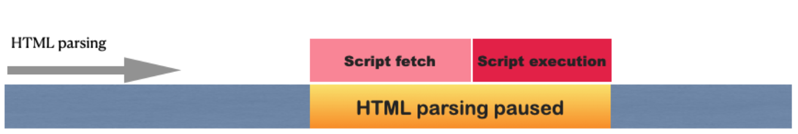
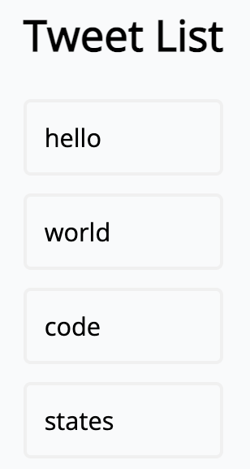
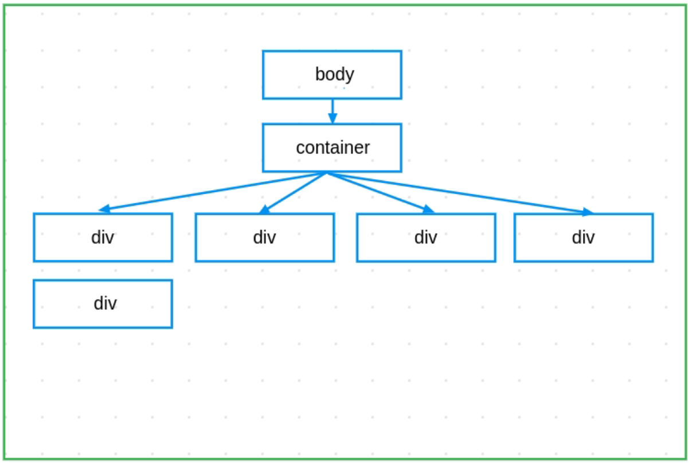
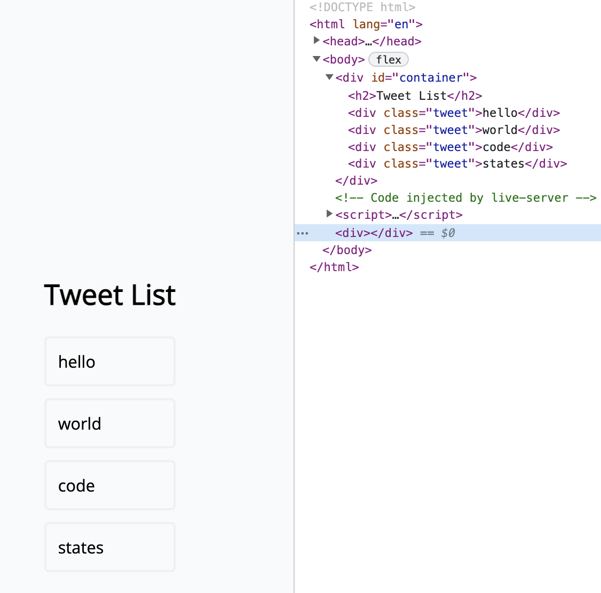
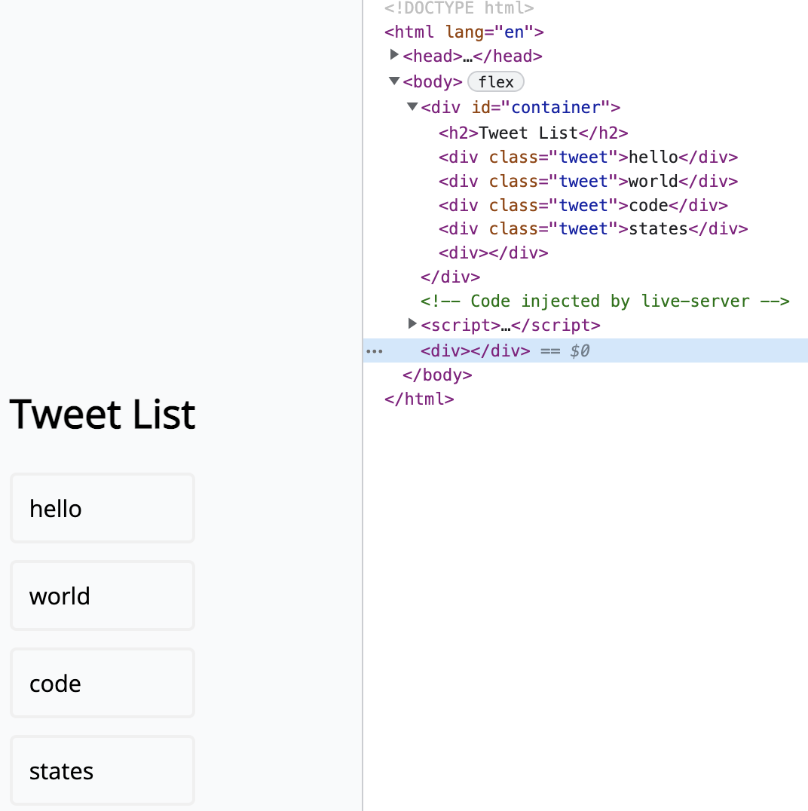
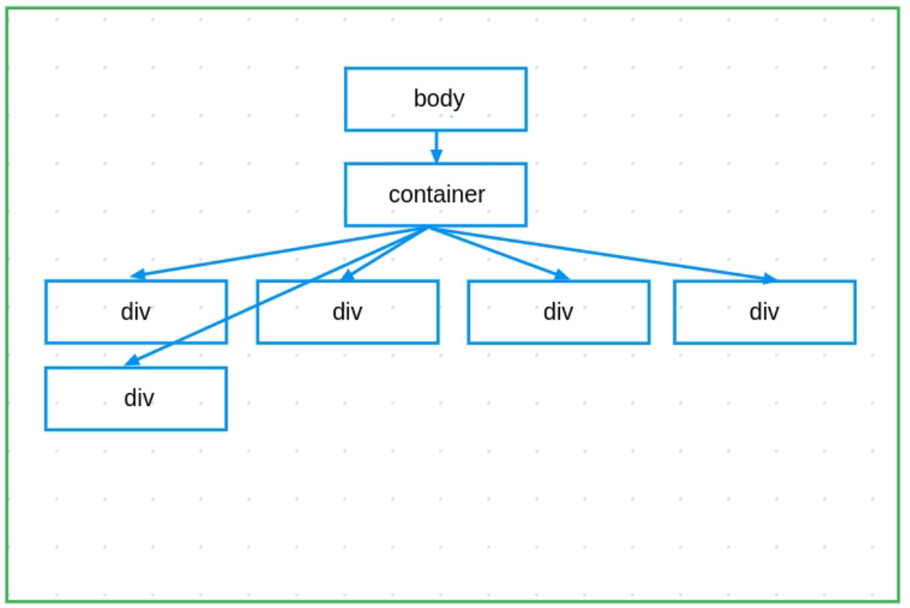
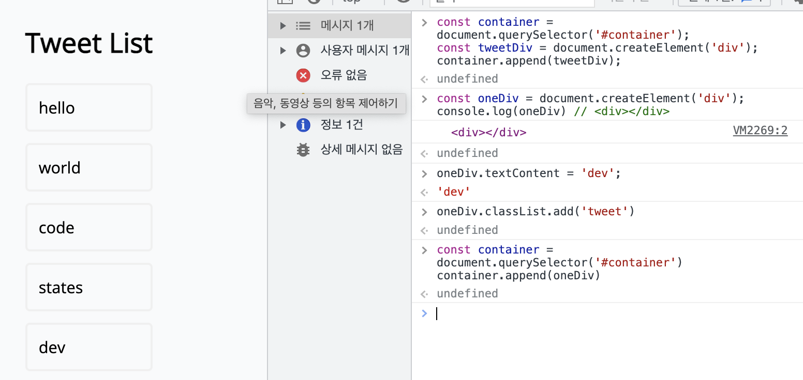
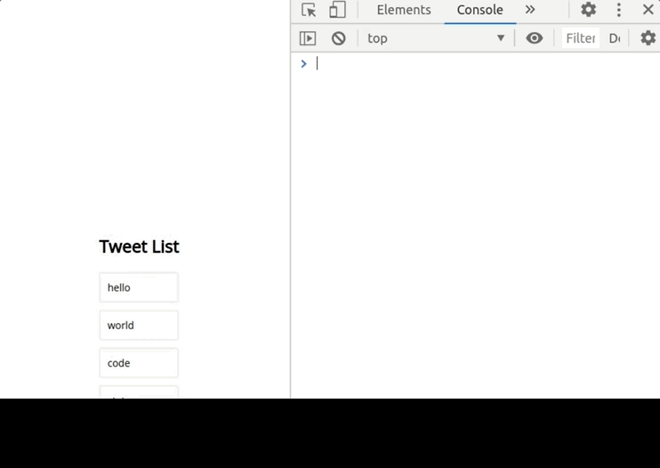
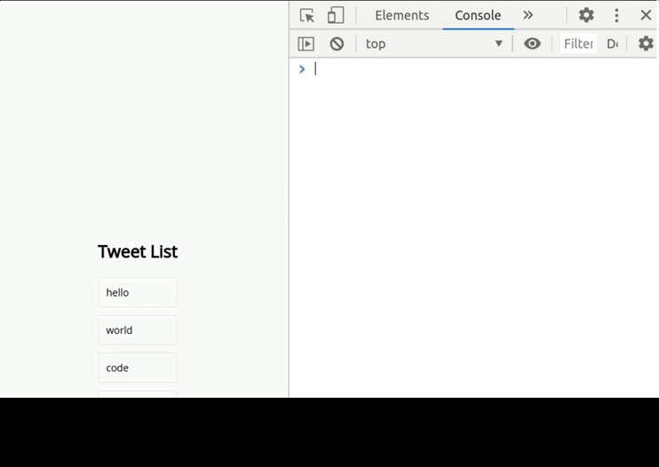

* this unordered seed list will be replaced by the toc
{:toc}

<!--more-->

### HTML에 JavaScript 적용하기

HTML에 JavaScript를 적용하려면 <scritp></scritp>태그를 이용한다.  
웹 브라우저가 작성된 코드를 해석하다 스크립트 태그를 만나면 HTML코드 해석을 멈추고 스크립트 태그를 먼저 실행한다. (등장과 함께)  

  

**이 떄, 스크립트 요소를 HTML에 추가하는 두 가지 방법이 있다.  
1. <head></head>에 추가하기
2. </body>가 끝나기 전에 추가하기.

//* 왜 인지 추가하기  

**<span style="color: tomato; font-size: 1.2rem">자바스크립트라는 프로그래밍 언어와 DOM을 이용해 HTML에 접근하고 조작한다.</span>**  


## DOM 다루기

<details>
<summary style="color: tomato; font-size: 1.2rem">Tip</summary>
<div markdown="1">

- DOM구조를 조회할 때에는 `console.dir`이 유용하다
`console.dir`은 `console.log`와 달리 DOM을 객체의 모습으로 출력한다.  

</div>
</details>

아래의 이미지처럼 Tweetlist를 만들어보았다.  
요소를 만들고, 추가하고, 수정하고, 삭제해볼 것이다.  
  

### CREATE

**<span style="color: tomato; font-size: 1.2rem">document.createElement('div')</span>**  
= 새로운 'div'요소를 만든다


```javascript
document.createElement('div'); //'div'요소를 만들었다

const tweetDiv = document.createElement('div'); //'div'요소를 만들어 'twetDiv'에 할당했다.
```

  

'div'요소를 만들었다. 그러나 Tweetlist에는 보이지 않을 것이다. 왜냐하면 요소에 추가하지 않았기 때문이다.


### APPEND
create에서 생성한 twwetDiv라는 변수는 아직 **공중에 붕 뜬 상태**다.
그러므로 create에서 생성한 tweetDiv를 트리구조와 연결한다. -> Tweetlist에 append한다.  

**<span style="color: tomato; font-size: 1.2rem">document.body.append(tweetDiv)</span>**  
= `tweetDiv`에 담긴 새로운 `<div>`요소를 `<body>`요소에 `append`한다.


  


'tweetDiv'에 담긴 'div'요소를 'body'요소에 append했다. 그러나 아직 Tweetlist에는 보이지 않을 것이다. 왜냐하면 추가된 요소에 내용이 작성되어 있지 않기 때문이다.  

그런데 뭔가 거슬린다. 왜 새로 만든 'div'요소는 '#container'에 들어가 있지 않을까? 넣으려면 어떻게 해야할까?

### READ 
DOM을 이용해 HTML Element를 조회하는 방법이다.  

- **클래스 이름**이 `tweet`인 HTML 엘리먼트 중 첫 번째 엘리먼트를 조회한다.
**<span style="color: tomato; font-size: 1.2rem">querySelector</span>**  


```javascript
const oneTweet = document.querySelector('.tweet');
```


- **클래스 이름**이 `tweet`인 HTML 엘리먼트 전부를 조회한다.
**<span style="color: tomato; font-size: 1.2rem">querySelectorAll</span>**  

<details>
<summary style="color: tomato">그리고</summary>
<div markdown="1">

이렇게 조회한 HTML요소들은 배열처럼 'for'문을 사용할 수 있다. (배열은 아님)  
이런 배열 아닌 배열을 '유사배열', '배열형 객체' 등 다양하게 부른다.  
정식 명칭은 `Array-like Object`이다.

</div>
</details>


```javascript
const tweets = document.querySelectorAll('.tweet');
```

<details>
<summary style="color: tomato">+옛날방식인 getElementById</summary>
<div markdown="1">

DOM조회 메서드인 `getElementById`는 `querySelector`와 비슷한 역할을 하는 오래된 방식이다.


```javascript
const getOneTweet = document.getElementById('container')
const queryOneTweet = document.querySelector('#container')
console.log(getOneTweet === queryOneTweet) // true
```


</div>
</details>


#### tweetDiv를 container에 추가하기

```javascript
const container = document.querySelector('#container')
const tweetDiv = document.createElement('div')
container.append(tweetDiv)
```


  
)


각각 변수에 담아 append해주면 된다.  
내용을 추가해보자  


### UPDATE

예시는 아래 코드로 시작한다.
```javascript
const oneDiv = document.createElement('div');
```


#### 1. 비어있는 엘리먼트에 문자열 추가하기
**<span style="color: tomato; font-size: 1.2rem">textContent</span>**  


```javascript
oneDiv.textContent = 'dev';
console.log(oneDiv); //<div>dev</div>
```


#### 2. 엘리먼트에 `class` 추가하기
CSS스타일링 적용 등 클래스가 필요할 때 사용한다.  
**<span style="color: tomato; font-size: 1.2rem">classList.add</span>**  


```javascript
oneDiv classList.add('tweet');
console.log(oneDiv); // <div class="tweet">dev</div>
```

텍스트를 넣고, 클래스를 추가해 CSS까지 적용되게 한 후 다시 append한다.  




* class, id 말고 다른 속성(attribute)추가하려면 -> `setAttribute`


### DELETE
삭제하는 방법에도 여러 가지가 있다.  

#### 1. 삭제하려는 요소의 위치를 알고 있는 경우  
앞서 생성하고 추가한 `tweetDiv`를 `remove` 메서드를 이용해 삭제해보자

```javascript
const container = document.querySelector('#container')
const tweetDiv = document.createElement('div')
container.append(tweetDiv)
tweetDiv.remove() // 이렇게 append 했던 요소를 삭제할 수 있다.

//id가 container인 요소 아래에 TweetDiv를 추가하고, remove로 삭제한다.
```

### 2. 여러 개의 자식 요소를 지우고 싶다면
<span style="color: tomato; font-size: 1.2rem">innerHTML</span>을 이용한다.


```javascript
// 컨테이너의 모든 자식 요소를 지우려면,
document.querySelector('#container').innerHTML = '';
```


`innerHTML`은 분명 편리하나 <span style="color: royalblue">보안에서 몇 가지 문제를 가지고 있기에</span> 다른 메서드를 사용한다.  


<span style="color: tomato; font-size: 1.2rem">removeChild</span>  


`removeChild`는 자식 요소를 지정해서 삭제하는 메서드이다.  
모든 자식 요소를 삭제하기 위해, 반복문(for, while, etc)을 활용할 수 있다.


```javascript
//자식 요소가 남아있지 않을 때까지 첫 번째 자식 요소를 삭제하는 코드

const container = document.querySelector('#container');
while(container.firstChild){
  container.removeChild(container.firstChild)
}

//container의 첫 번째 자식 요소가 존재하면, 첫 번째 자식 요소를 제거한다
```


`removeChild`와 `while`을 사용해 자식 요소를 삭제하면 제목인 H2 "Tweet List"까지 삭제된다.  
이를 방지하는 많은 방법 중 세가지를 아래에 기술하자면
{:.figcaption}

1. 자식 요소가 담고 있는 문자열을 비교해 "Tweet List"만 남기거나, 
2. 새로운 변수를 생성하고 Tweet List를 할당해뒀다가 반복문이 끝난 뒤에 새롭게 추가하거나
3. 혹은 자식 요소를 하나만 남기게 하거나
4. 직접 클래스 이름이 'tweet'인 요소만 찾아 지우는 방법이 있다.

```javascript
//3. 자식 요소 하나만 남기기

const container = document.querySelector('#container');
while(container.children.length > 1){
  container.removeChild(container.lastChild);
}


//4. 클래스 이름이 tweet인 요소만 찾아 제거하기

const tweets = document.querySelectorAll('.tweet');
tweets.forEach(function(tweet){
  tweet.remove();
})

//혹은

for(let tweet of tweets){
  tweet.remove();
}

```


클래스 이름이 'tweet'인 요소를 모두 삭제한다
{:.figcaption}


