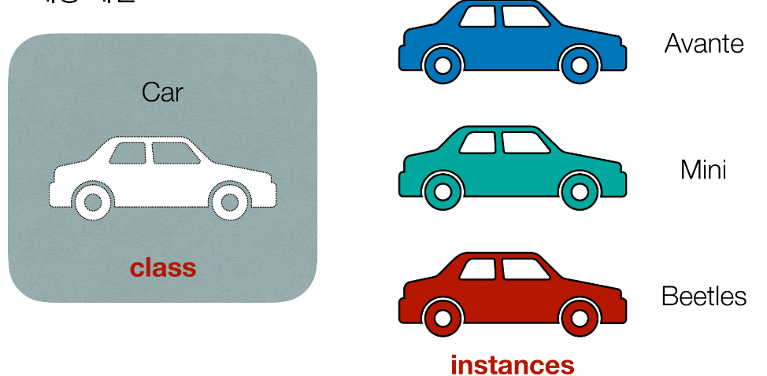
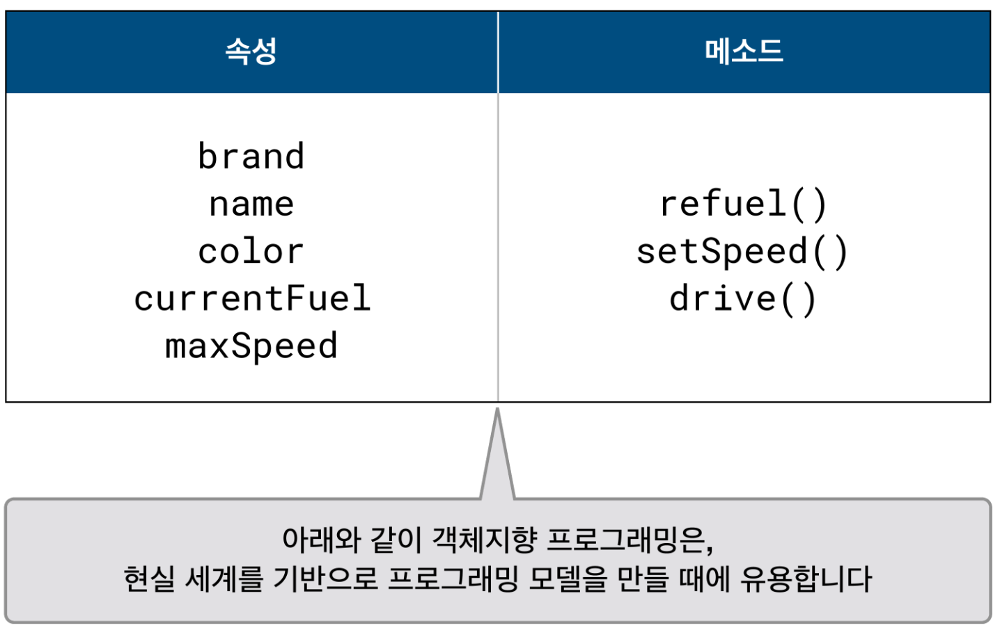
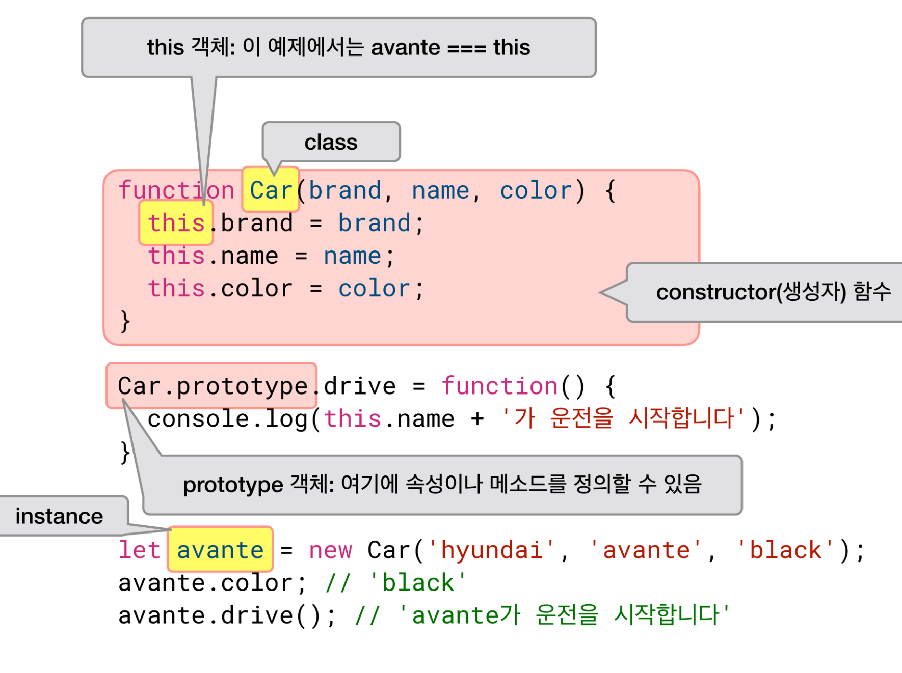

* this unordered seed list will be replaced by the toc
{:toc}

<!--more-->

> 객체 지향 프로그래밍은, 절차 지향 프로그래밍과는 다르게 데이터와 기능을 한 곳에 묶어서 처리한다.  
> 속성과 메서드가 하나의 "객체"라는 개념에 포함되며, 이는 자바스크립트 내장 타입인 `object`와는 다르게, 클래스(Class)라는 이름으로 부른다.  


## 객체 지향 프로그래밍
객체 지향 프로그래밍은  
하나의 ==모델이 되는 청사진==을 만들고 <span style="color: tomato; font-size: 1.2rem">class</span>  
그 ==청사진을 바탕으로 한 객체==를 만드는<span style="color: tomato; font-size: 1.2rem">instance</span>  
==프로그래밍 패턴==  

  
기본적인 설계로 자동차의 청사진을 그려놓기. -> 청사진을 바탕으로 각각의 객체가 특정한 자동차 모델로 만들어짐
{:.figcaption}


### instance 만들기
instance는 그냥 일반적인 함수를 정의하듯 만든다.  
근데 함수를 이용하는 방법이 조금 다르다.  
==<span style="font-size: 1.2rem">new</span>==키워드를 사용해 만든다.  

```javascript
let avante = new Car('hyundai', 'avante', 'black');
let mini = new Car('bmw', 'ini', 'white');
let beetles = new Car('volkswagen', 'beetles', 'red');
//각각의 인스턴스는 'Car'라는 클래스의 고유한 속성과, 메소드를 갖는다.
```

### class 만들기
#### ES5
==<span style="font-size: 1.2rem">대문자</span>==로 시작하며 ==<span style="font-size: 1.2rem">일반명사</span>==로 만든다.  
(일반 함수는 적절한 동사를 포함하고 소문자로 시작하는 것과는 대조적이다.)  

#### ES6
신문법 ES6에 새로운 방법이 도입되었는데 `class`키워드이다.  
최근엔 이 방법이 자주 쓰인다고 한다.  

ES5와 ES6의 차이를 아래 코드로 알아보면

```javascript
//ES5
function Car(brand, name, color){
  //인스턴스가 만들어질 때 실행되는 코드
}

//ES6
class Car {
  constructor(brand, name, color){
    //인스턴스가 만들어질 때 실행되는 코드
  }
}
```

위에서 보이는 함수는 객체지향 프로그래밍에서 `생성자(constructor)함수`라고 한다.  
생성자 함수는 return 값을 만들지 않는다.  


## 속성과 메서드
클래스에 속성과 메소드를 정의하고, 인스턴스에서 이용한다.  

? 자동차로 속성과 메서드를 생각해보면
- 속성: 브랜드, 차 이름, 색상, 현재 연료 상태, 최고 속력 , 옵션 등
- 메서드: (객체에 딸린 함수) 연료 주입, 속력 설정, 운전 등

  


### 속성? this?
객체 지향 프로그래밍에서 빠지지 않고 등장하는 키워드 `this`.  
==인스턴스 객체==를 의미한다.  

```javascript
//ES5
function Car(brand, name, color){
  this.brand = brand;
  this.name = name;
  this.color = color;
}

//ES6
class Car {
  constructor(brand, name, color){
    this.brand = brand;
    this.name = name;
    this.color = color;
  }
}
```

`parameter`로 넘어온 브랜드, 이름, 색상 등은 인스턴스 생성 시 지정하는 값이며,  
`this`에 할당한다는 것은 => 만들어진 인스턴스에 해당 브랜드, 이름, 색상을 부여하겠다는 의미.  

### 메서드? 

```javascript
//ES5
function Car(brand, name, color){
  Car.prototype.refuel = function(){
    //연료 공급을 구현하는 코드
  }
  Car.prototype.drive = function(){
    //운전을 구현하는 코드
  }
}
```

ES5는 prototype이라는 키워드를 사용해야 메서드를 정의할 수 있다.  
Car 클래스에 메서드를 추가하기 위해서 `Car.prototype.fuel`같이 `prototype`을 이용해야 함.  

```javascript
class Car {
  constructor(brand, name, color){/* 생략 */}

  refuel(){

  }

  drive(){

  }
}
```

ES6는 생성자 함수와 함께 class 키워드 안쪽에 묶어서 정의한다.  
`refule(){}`,`drive(){}`와 같이 작성되어 있는 부분을 말한다.


### Instance에서 사용하는 법

```javascript
let avante = new Car('hyundai', 'avante', 'black');
avante.color; // 'black'
avante.drive(); //아반떼가 운전을 시작합니다.

let mini = new Car('bmw', 'nmini', 'white');
mini.brand; // 'bmw'
mini.refuel(); //미니에 연료를 공급합니다.
```

### prototype? constructor? this?
|용어|용어설명|
|----|-----|
|prototype|모델의 청사진을 만들 때 쓰는 원형 객체(original form)이다|
|constructor|인스턴스가 초기화될 때 실행하는 ==생성자== 함수|
|this|함수가 실행될 때, 해당 scope마다 생성되는 고유한 실행 context. ==new==키워드로 인스턴스를 생성했을 땐, 해당 인스턴스가 바로 this의 값이 된다.|
JavaScript에만 유효한 용어이다. 하지만 중요하다.  
{:.figcaption}


## 중요하니 외우자


ES5방식이고 현재는 신문법이 더 잘 쓰이므로 신문법도 잘 외워두자.
{:.figcaption}

```javascript
class Car{
  constructor(brand, name, color){
    this.brand = brand;
    this.name = name;
    this.color = color;
  }
  drive(){
    console.log(this.name + '가 운전을 시작합니다');
  }
}

let avante = new Car('hyundai', 'avante', 'black');
avante.color; //'black'
avante.drive(); // 'avante'가 운전을 시작합니다.
```

<details>
<summary style="color: tomato; font-size: 1.2rem">배열은 Array의 인스턴스다?</summary>
<div markdown="1">

```javascript
let avante = new Car('hyundai', 'avante', 'black');
avante.color; //'black'
avante.drive(); //아반떼가 운전을 시작합니다.

let arr = ['hi', 'my', 'name'];
arr.length //3
arr.push('is') // ['hi', 'my', 'name', 'is']
```

배열은 전부 Array의 인스턴스이다!!!!  
속성, 메서드 사용법이 동일하다!!  

<span style="color: royalblue; font-size: 1.2rem">new Array(__, __, __)</span>  

와 같은 방식으로도 배열을 만들 수 있다!  

==배열을 정의한다 === Array의 인스턴스를 만들어낸다==  

(mdn 메서드 설명에 prototype이라고 붙어있는 이유는 모든 메서드들이 클래스의 원형 객체에 정의되어 있기 때문이다.)  

</div>
</details>