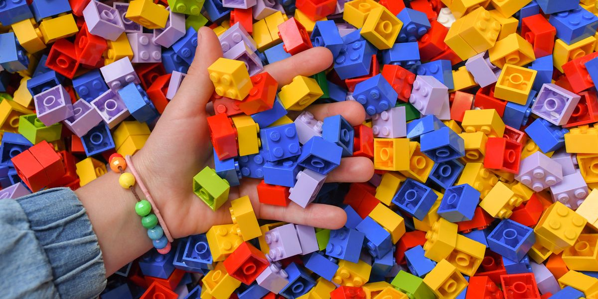

* this unordered seed list will be replaced by the toc
{:toc}

<!--more-->

> 객체 지향 프로그래밍은, 절차 지향 프로그래밍과는 다르게 데이터와 기능을 한 곳에 묶어서 처리한다.  
> 속성과 메서드가 하나의 "객체"라는 개념에 포함되며, 이는 자바스크립트 내장 타입인 `object`와는 다르게, 클래스(Class)라는 이름으로 부른다.  

# 절차적 언어

옛날 옛적엔 프로그래밍언어를 보통 ‘절차적 언어’라고 불렀다. (C, 포트란 등이 있다고 한다)  
절차적 언어란 무엇이냐, ‘절차대로 합시다!‘ 에서 풍기는 뉘앙스처럼 순서대로,  

순차적으로 명령들을 처리하는 언어를 말한다.  

근데 이게 생각보다 불편한거다.  
왜? 순서가 지나가면 그대로 끝인거니까..!  
예전에 학교에서 급식먹다보면 맛있는 반찬은 더 먹고 싶을 때가 있지 않은가?  
하지만 그렇다고 해서 중간에 끼어서 반찬을 더 달라고 했다간 뒤에서 차례를 기다리며 쏘아보는 학우들의 눈빛레이저에 타버리고 말 것이다.  

# 객체 지향 언어
그래서 등장한 것이 바로 이 객체 지향 언어이다.  
물론 순차적으로 작동은 한다. 하나의 커다란 대 전제인 것이다.  
하지만 그 안에서 데이터의 접근, 처리과정에 대한 것들이 각각 그룹을 만들어 보다 효율적으로 데이터를 처리할 수 있게 된 것이다.  

이렇게 생각하면 어떨까?  
우리가 레고를 만든다고 생각해보자.  

당신은 집을 만들 것이고 나는 자동차를 만들거다.  
함께 레고들을 모두 가운데에 쏟아놓고 이제 레고를 만드는데…. <-이러면 진행속도도 더디고 아무거나 갖다쓰다가 뒤늦게 다시 부품을 찾고.. 이런 일이 반복될 것이다.  

하지만, 각자의 레고를 서로에게서 분리하고, 그 안에서 색깔대로, 모양대로 모아 레고를 만든다면? 비록 분류과정에서 시간이 조금 걸릴지 몰라도 실제로 조립을 시작하면 금방 완성될 것이다!  

이러한 개념의 객체 지향 언어는 ‘클래스’라고 부르는 데이터 모델의 청사진을 사용해 코드를 작성하는 특징이 있고,  
현대의 언어들은 대부분 객체 지향의 특징을 가지고 있다. (Java, C++, C#..등등..)  
(그러나 자바스크립트는 엄말히 말해 객체 지향 언어는 아니다. 하지만 객체 지향 패턴으로 작성할 수는 있지.)

## OOP
1. OOP는 프로그램 설계철학이다.
2. OOP의 모든 것은 "객체"로 그룹화된다.
3. OOP의 4가지 주요 개념을 통해 재사용성을 얻을 수 있다.

객체 내에는 ==데이터와 기능이 함께 있다==라는 원칙에 따라 메서드와 속성이 존재한다.  
