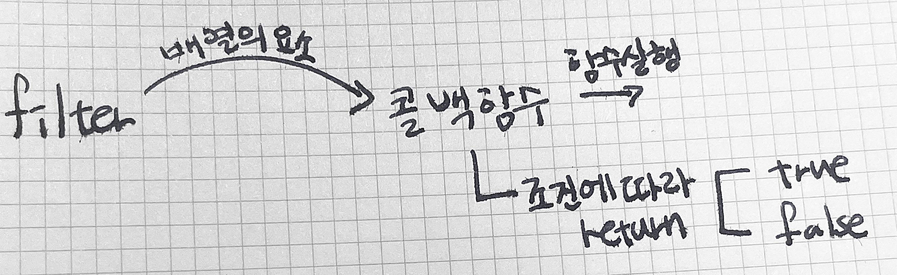
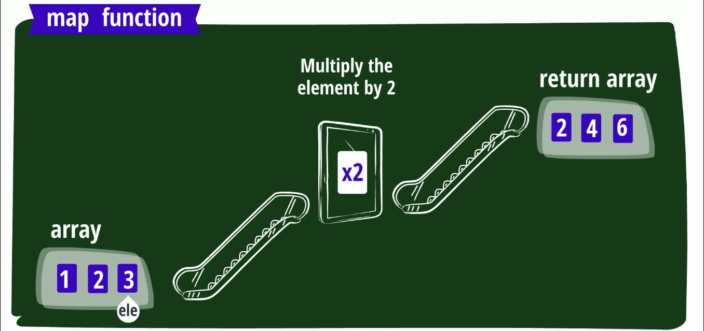

*  this unordered seed list will be replaced by the toc
{:toc}


>JS에서 특별 대우받는 일급 객체 = 함수
>1. 변수에 할당 가능
>2. 다른 함수의 전달인자로 전달 가능
>3. 다른 함수의 결과로 리턴 가능
>⇒ 함수를 배열의 요소나 객체의 속성값으로 저장 가능
>⇒ 함수를 데이터(string, number, boolean, array, object)처럼 다룰 수 있음


```jsx
/*
 * 아래는 변수 square에 함수를 할당하는 함수 표현식입니다.
 * JavaScript에서 함수는 일급 객체이기 때문에 변수에 할당할 수 있습니다.
 *
 * 함수 표현식은 할당 전에 사용할 수 없습니다.
 * square(7); // --> ReferenceError: Can't find variable: square
 */

const square = function (num) {
  return num * num;
};

// 변수 square에는 함수가 할당되어 있으므로 (일급 객체), 함수 호출 연산자 '()'를 사용할 수 있습니다.
output = square(7);
console.log(output); // --> 49
```

# 내장 고차 함수

<aside>
💡 배열 메서드 중 일부가 대표적인 고차함수
filter, map, reduce

</aside>

## 1. FILTER

<aside>
💡 배열의 모든 요소 중에서 **특정 조건을 만족하는 요소**를 걸러냄
기존배열 수정 X

</aside>

#예를들어, number배열에서

1. 짝수만 걸러내기
2. 18보다 작은 수 걸러내기

#예를들어 string타입 문자열에서

1. 길이가 10이하인 문자열만 걸러내기
2. ’me’와 같은 특정 문자열만 걸러내기

```jsx
// 아래 코드에서 '짝수'와 '길이 5 이하'는 문법 오류(syntax error)에 해당합니다.
// 의미만 이해해도 충분합니다.
let arr = [1, 2, 3, 4];
let output = arr.filter(짝수);
console.log(output); // ->> [2, 4]

arr = ['hello', 'code', 'states', 'happy', 'hacking'];
output = arr.filter(길이 5 이하)
console.log(output); // ->> ['hello', 'code', 'happy']
```

```jsx
// 아래 코드는 정확한 표현 방식은 아닙니다.
// 의미만 이해해도 충분합니다.

let arr = [1, 2, 3];
// 배열의 filter 메서드는 함수를 전달인자로 받는 고차 함수입니다.
// arr.filter를 실행하면 내부적으로 arr에 접근할 수 있다고 생각해도 됩니다.
arr.filter = function (arr, func) {
  const newArr = [];
  for (let i = 0; i < arr.length; i++) {
    // filter에 전달인자로 전달된 콜백 함수는 arr의 각 요소를 전달받아 호출됩니다.
    // 콜백 함수가 true를 리턴하는 경우에만 새로운 배열에 추가됩니다.
    if (func(arr[i]) === true) {
      newArr.push(this[i]);
    }
  }
  // 콜백 함수의 결과가 true인 요소들만 저장된 배열을 리턴합니다.
  return newArr;
};

/*
 * filter 메서드의 보다 정확한 정의는 아래와 같습니다. 아래 코드를 이해하기 위해서는 다음 유닛에서 프로토타입과 this에 대한 학습이 필요합니다.
 * Array.prototype.filter = function(func) {
 *   const arr = this;
 *   const newArr = []
 *   for(let i = 0; i < arr.length; i++) {
 *     if (func(arr[i]) === true) {
 *       newArr.push(this[i])
 *     }
 *   }
 *   return newArr;
 * }
 */
```



```jsx
// 함수 표현식
const isEven = function (num) {
  return num % 2 === 0;
};

let arr = [1, 2, 3, 4];
// let output = arr.filter(짝수);
// '짝수'를 판별하는 함수가 조건으로서 filter 메서드의 전달인자로 전달됩니다.
let output = arr.filter(isEven);
console.log(output); // ->> [2, 4]

const isLteFive = function (str) {
  // Lte = less then equal
  return str.length <= 5;
};

arr = ['hello', 'code', 'states', 'happy', 'hacking'];
// output = arr.filter(길이 5 이하)
// '길이 5 이하'를 판별하는 함수가 조건으로서 filter 메서드의 전달인자로 전달됩니다.
let output = arr.filter(isLteFive);
console.log(output); // ->> ['hello', 'code', 'happy']
```

- 예시문제
    
    문제 : 만화책 식객 27권의 정보가 배열에 담겨 있습니다. 출판 연도가 2003인 단행본만 담은 배열을 만드세요
    
    - 수도코드
        - 배열의 각 요소 : 각 식객 1- 27권의 정보
        - 특정 논리(함수) : 책의 출판 연도가 2003년입니다. (true / false)
        - 따로 분류 : 출판 연도가 2003년인 책의 정보
    - 실제코드
        
        ```jsx
        // 단행본 모음
        const cartoons = [
          {
            id: 1,
            bookType: 'cartoon',
            title: '식객',
            subtitle: '어머니의 쌀',
            createdAt: '2003-09-09',
            genre: '요리',
            artist: '허영만',
            averageScore: 9.66,
          },
          {
            id: 2,
            // .. 이하 생략
          },
          // ... 이하 생략
        ]; 
        
        // 단행본 한 권의 출판 연도가 2003인지 확인하는 함수
        const isCreatedAt2003 = function (cartoon) {
          const fullYear = new Date(cartoon.createdAt).getFullYear()
          return fullYear === 2003;
        }; 
        
        // 출판 연도가 2003년인 책의 모음
        const filteredCartoons = cartoons.filter(isCreatedAt2003);
        ```
        

## 2. MAP

<aside>
💡 모든 요소에게 동일한 행동을 준 값에 대하여 모두 반환 
기존배열 수정 X

</aside>



- 예시문제
    
    문제 : 만화책 식객 27권의 정보가 배열에 담겨있다. 각 책의 부제만 담은 배열을 만들어라
    
    - 수도코드
        - 배열의 각 요소 : 각 식객 1- 27권의 정보
        - 특정 논리(함수) : 책 한 권의 부제를 찾습니다.
        - 다른 요소로 지정 : 각 식객 1- 27권의 부제
    - 실제코드
        
        ```jsx
        // 만화책 모음
        const cartoons = [
          {
            id: 1,
            bookType: 'cartoon',
            title: '식객',
            subtitle: '어머니의 쌀',
            createdAt: '2003-09-09',
            genre: '요리',
            artist: '허영만',
            averageScore: 9.66,
          },
          {
            id: 2,
            // .. 이하 생략
          },
          // ... 이하 생략
        ]; 
        
        // 만화책 한 권의 부제를 리턴하는 로직(함수)
        const findSubtitle = function (cartoon) {
          return cartoon.subtitle;
        }; 
        
        // 각 책의 부제 모음 
        const subtitles = cartoons.map(findSubtitle); // ['어머니의 쌀', ...]
        ```
        

## 3. Reduce

<aside>
💡 배열의 각 요소를
특정 방법(함수)에 따라
원하는 하나의 형태로
응축합니다

</aside>

- 예시문제
    
    문제 : 만화책 식객 27권의 정보가 배열에 담겨있습니다. 각 단행본의 평점의 평균을 리턴하세요.
    
    - 수도코드
        - 배열의 각 요소 : 각 식객 1- 27권의 정보
        - 응축하는 방법 (함수) : 각 단행본의 평점을 누적값에 더합니다.
        - 원하는 형태 : 숫자로 누적합니다.
        - 응축된 결과 : 각 단행본의 평점의 합을 단행본의 길이로 나눈 평점의 평균
    - 실제코드
        
        ```jsx
        // 단행본 모음
        const cartoons = [
          {
            id: 1,
            bookType: 'cartoon',
            title: '식객',
            subtitle: '어머니의 쌀',
            createdAt: '2003-09-09',
            genre: '요리',
            artist: '허영만',
            averageScore: 9.66,
          },
          {
            id: 2,
            // .. 이하 생략
          },
          // ... 이하 생략
        ];
        
        // 단행본 한 권의 평점을 누적값에 더한다.
        const scoreReducer = function (sum, cartoon) {
          return sum + cartoon.averageScore;
        }; 
        
        // 초기값에 0을 주고, 숫자의 형태로 평점을 누적한다.
        let initialValue = 0 
        // 모든 책의 평점을 누적한 평균을 구한다.
        const cartoonsAvgScore = cartoons.reduce(scoreReducer, initialValue) / cartoons.length;
        ```
        

### 1. Reduce의 색다른 사용법_배열을 문자열

- 수도코드
    - 배열의 각 요소 : 유저 정보
    - 응축하는 방법 (함수) : 하나의 유저의 이름과 쉼표를 이어 붙입니다(concat)
    - 원하는 형태 : 문자열로 누적합니다.
    - 응축된 결과 : 쉼표로 구분되는 모든 유저의 이름
- 실제코드
    
    ```jsx
    function joinName(resultStr, user) {
      resultStr = resultStr + user.name + ', ';
      return resultStr;
    }
    
    let users = [
      { name: 'Tim', age: 40 },
      { name: 'Satya', age: 30 },
      { name: 'Sundar', age: 50 }
    ];
    
    users.reduce(joinName, '');
    ```
    
- 실습
    
    reduce의 콜백함수 `joinName`은 총 몇 번 실행되나요? 다음 표에 들어가는 값은 각각 무엇인가요?
    
    ```jsx
    호출 횟수 | resultStr | user | 리턴 값
    -------- | --------- | --------- | ---------
    1번째 호출 |  `______` | `______` | `______`
    2번째 호출 |  `______` | `______` | `______`
    n번째 호출 |  `______` | `______` | `______`
    ```
    

### 2. Reduce의 색다른 사용법_배열을 객체로

- 수도코드
    - 배열의 각 요소 : 유저 정보
    - 응축하는 방법 (함수) : 유저 한 명의 이름 중 첫 글자를 주소록 객체 속성의 키(key)로, 유저의 정보를 주소록 객체 속성의 값(value)으로 추가합니다.
    - 원하는 형태 : 주소록 객체에 누적합니다.
    - 응축된 결과 : 모든 유저의 정보가 알파벳으로 구분된 주소록
- 실제코드
    
    ```jsx
    function makeAddressBook(addressBook, user) {
      let firstLetter = user.name[0];
    
      if(firstLetter in addressBook) {
        addressBook[firstLetter].push(user);
      } else {
        addressBook[firstLetter] = [];
        addressBook[firstLetter].push(user);
      }
    
      return addressBook;
    }
    
    let users = [
      { name: 'Tim', age: 40 },
      { name: 'Satya', age: 30 },
      { name: 'Sundar', age: 50 }
    ];
    
    users.reduce(makeAddressBook, {});
    ```
    
- 실습
    
    reduce의 콜백함수 `makeAddressBook`은 총 몇 번 실행되나요? 다음 표에 들어가는 값은 각각 무엇인가요?
    
    ```jsx
    호출 횟수 | addressBook | user | 리턴 값
    -------- | --------- | --------- | ---------
    1번째 호출 |  `______` | `______` | `______`
    2번째 호출 |  `______` | `______` | `______`
    n번째 호출 |  `______` | `______` | `______`
    ```
    
    **최종리턴값**
    
    ```jsx
    {
      T: [
        { name: 'Tim', age: 40 }
      ],
      S: [
        { name: 'Satya', age: 30 },
        { name: 'Sundar', age: 50 }
      ]
    }
    ```
    

# 고차함수의 중요성

> 값 수준의 추상화 : 단순히 값을 전달받아 처리하는 수준
사고의 추상화 : 함수(사고의 묶음)을 전달받아 처리하는 수준
고차함수 = 함수를 전달받거나 함수를 린턴한다
= 사고(함수)에 대한 복잡한 로직은 감추어져 있다.
= 사고 수준에서의 추상화
>