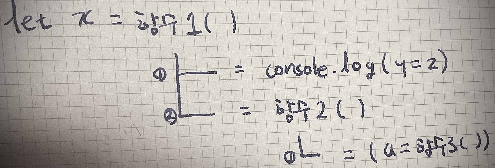

*  this unordered seed list will be replaced by the toc
{:toc}



> 다른 함수의 전달인자로 전달되는 함수 = 콜백함수

#### 콜백함수를 전달받은 고차함수?

함수 내부에서 콜백함수 호출 가능
조건에 따라 콜백함수의 실행여부 결정

여러번 실행할 수도 있고 / 아예 호출 안할 수도 있다

#### 와아 재밌는 사실 ~

함수를 리턴하는 함수를 고안해 낸 *하스켈 커리*라는 사람의 이름을 따 커링 함수라고 부름.
단, 함수를 전달인자로 받는 함수에만 한정해 사용.

고차함수>>>>>커링함수

## 1. 다른 함수를 인자로 받는 경우

```jsx
function double(num) {
  return num * 2;
}

function doubleNum(func, num) {
  return func(num);
}

/*
 * 함수 doubleNum은 다른 함수를 인자로 받는 고차 함수입니다.
 * 함수 doubleNum의 첫 번째 인자 func에 함수가 들어올 경우
 * 함수 func는 함수 doubleNum의 콜백 함수입니다.
 * 아래와 같은 경우, 함수 double은 함수 doubleNum의 콜백 함수입니다.
 */
let output = doubleNum(double, 4);
console.log(output); // ->
```

## 2. 함수를 리턴하는 경우

```jsx
function adder(added) {
  return function (num) {
    return num + added;
  };
}

/*
 * 함수 adder는 다른 함수를 리턴하는 고차 함수입니다.
 * adder는 인자 한 개를 입력받아서 함수(익명 함수)를 리턴합니다.
 * 리턴되는 익명 함수는 인자 한 개를 받아서 added와 더한 값을 리턴합니다.
 */

// adder(5)는 함수이므로 함수 호출 연산자 '()'를 사용할 수 있습니다.
let output = adder(5)(3); // -> 8
console.log(output); // -> 8

// adder가 리턴하는 함수를 변수에 저장할 수 있습니다.
// javascript에서 함수는 일급 객체이기 때문입니다.
const add3 = adder(3);
output = add3(2);
console.log(output); // -> 5
```

## 3. 함수를 인자로 받고, 함수를 리턴하는 경우

```jsx
function double(num) {
  return num * 2;
}

function doubleAdder(added, func) {
  const doubled = func(added);
  return function (num) {
    return num + doubled;
  };
}

/*
 * 함수 doubleAdder는 고차 함수입니다.
 * 함수 doubleAdder의 인자 func는 함수 doubleAdder의 콜백 함수입니다.
 * 함수 double은 함수 doubleAdder의 콜백으로 전달되었습니다.
 */

// doubleAdder(5, double)는 함수이므로 함수 호출 기호 '()'를 사용할 수 있습니다.
doubleAdder(5, double)(3); // -> 13

// doubleAdder가 리턴하는 함수를 변수에 저장할 수 있습니다. (일급 객체)
const addTwice3 = doubleAdder(3, double);
addTwice3(2); // --> 8
```